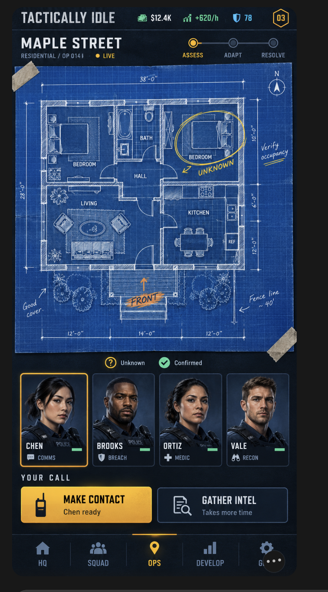

# Tactically Idle game and first playable plan

**Status:** Draft for product and implementation review. Visual direction approved by the user; mechanics, balance, commercial model, and production estimates remain proposals.

**Created and updated:** October 1, 2026, America/New_York. **Prepared by:** Codex from the user's game concept, approved image, and public Reddit discussions. **Audience:** The owner and future design, art, and engineering contributors.

## Recommendation

Build a portrait mobile department-management game with a productive idle economy and short, branching tactical operations. The player hires people, develops capabilities, prepares squads, and makes decisions on a marked-up blueprint. Consequences return to the department as experience, stress, resource use, and public trust.

Start with one complete, visually representative operation loop. Prove that different teams and information produce different useful choices before expanding the mission catalog. The approved mockup is the visual baseline for this work, including the first playable. Its illustrated character and architectural detail must survive implementation.

The largest unresolved product question is whether short decision-based operations remain interesting on repeat visits. A second is whether recovery encourages roster planning without becoming an energy gate. These require playtests; neither has been settled by the mockup or Reddit research.

## Standing decisions and source constraints

### Decided by the user

1. The game is named **Tactically Idle** and is designed for mobile.
2. It combines idle progression, a development tree, and playable tactical operations.
3. Players hire and fire officers from a pool. Officers have traits, capabilities, and expected pay.
4. Players unlock training and equipment and manage inventory.
5. Operations use building blueprints and successive choices affected by the squad and equipment.
6. Stress creates recovery needs, particularly after adverse outcomes.
7. The attached detailed blue-paper operations mockup is the accepted visual reference. [cite: user requests and approval in this chat]
8. Location, room size, officer shooting proficiency, composure, and presented options must materially affect operations. Every generated blueprint needs corresponding game information. [cite: user's follow-up on meaningful blueprints]
9. The department can own up to **four** unique persistent squads and send one or more squads to an operation. [cite: user's squad-count instruction, raised from three to four on 2026-10-02]
10. Structures are varied and generated (non-rectangular footprints, at most two floors), with varied occupants, threats, placements and difficulty per run, and an auto-equip option. Specification: [phase 3 brief](docs/phase3-generation.md). [cite: user's 2026-10-02 instruction]

### Constraints

- Preserve the blue grid paper, architectural drawing, marker annotations, illustrated squad cards, dark framing, and amber actions of the approved image. [cite: approved reference]
- Make the operation visibly spatial; a generic text questionnaire with a decorative floorplan does not satisfy the request. [cite: original operation concept and rejection of the text-heavy mockup]
- Include recruitment, dismissal, recurring payroll, traits, training, equipment, inventory, branching operations, and recovery in the complete first playable loop. [cite: original feature request]
- Each consequential choice must have an observable dependency on scenario state, people, or equipment. [cite: original equipment/skill-dependent outcome request]
- Geometry and semantic location data must be the common source for the drawn blueprint, available actions, and outcome calculations. An independently generated image with inferred rules added afterward is insufficient. [cite: user's meaningful-blueprint requirement; implementation consequence]
- Support one, two, or three deployed squads where the operation allows it, with no duplicate personnel or physical equipment assignments. [cite: user's maximum-three-squads requirement; assignment-integrity consequence]

### Assumptions to validate

| Assumption | What settles it | Impact if wrong |
| --- | --- | --- |
| [assumed] Portrait is the default orientation. | Device playtest of the approved composition. | Screen layout and map controls need revision. |
| [assumed] Single-player, offline-first play is sufficient for the first release. | Owner's release requirements before production architecture. | Accounts, synchronization, and services expand scope. |
| [assumed] Fictional city, fictional officers, grounded but non-graphic tone. | Owner's content direction before writing the full catalog. | Art, writing, audience, and rating targets change. |
| [assumed] Three major operation stages support short sessions. | Repeat-play sessions with first-time players. | Branch length and pacing change. |
| [assumed] Core officers persist through district expansion. | Roster attachment and long-term progression testing. | Career and prestige design changes. |
| [assumed] Demo followed by a one-time unlock is a useful business hypothesis. | Pricing and willingness-to-pay work before commercial release. | Acquisition, packaging, and backend needs change. |

All numerical design targets below are **proposed starting values**, chosen for this draft rather than inferred from competitor success. They are editable balance parameters, not approved commitments.

## Intended players and observable outcomes

The initial audience is mobile idle players who enjoy planning and visible progression, and management players interested in a squad whose composition matters. Tactical-game enthusiasts are a secondary audience; their tolerance for abstract choices must be tested.

1. A player can leave and return to understandable, useful progress without payroll unexpectedly consuming their savings.
2. Changing an officer, certification, or item changes at least one available approach or outcome contributor.
3. A player can understand how a decision affected the operation and use that knowledge on the next assignment.
4. Stress makes a reserve roster useful while leaving department work or practice available.
5. The live operations screen preserves the approved image's visual identity at actual phone size.
6. Changing a location's size, room connections, or relevant position changes at least one explainable action cost, requirement, or resolution contributor.
7. The player can maintain three distinct squads and deploy multiple squads together, with distinct assignments, condition, and resource use.

## Approved visual reference

The screenshot records approval. Its outer capture frame and overflow-menu overlay are not product requirements. Its decorative dimensions, illustrated labels, balances, and character roles are examples rather than a validated simulation or final economy.

### Visual language

- **Operation map:** Saturated blue graph paper with fine grid lines, restrained grain and folds, white drafting ink, and irregular marker annotations. Tape corners and wear stay secondary.
- **Architecture:** Exterior wall thickness, connected interior rooms, door openings and swing arcs, paired window lines, furniture, plumbing fixtures, entrances, and porches. Each setting gets a plausible layout rather than repeated rectangular grids.
- **Annotations:** Amber means unresolved information or a proposed choice; mint means confirmed information. Pair both with symbols and labels. New information visibly changes the relevant room or annotation.
- **Characters:** Illustrated portraits, distinct faces, readable surnames, role symbols, and readiness bars. Selecting an officer highlights their relevant capability.
- **Chrome:** Dark navy/charcoal, condensed display typography, readable supporting type, compact resource indicators, and amber primary actions. Textures do not sit over essential small text.
- **Feedback:** Short marker strokes, changed map states, portrait reactions, and progress changes communicate consequences. Respect reduced-motion settings. Sound and haptics are optional enhancements after the core loop.

Do not render the entire interface as one bitmap. Keep portraits and paper textures as art assets; render interactive labels, states, hit targets, and buttons independently. The drawing layer and the operation data share room identifiers so visual information cannot drift from scenario logic.

### Screen composition

At the proposed 390 × 844 portrait design target, the blueprint is the largest contiguous content region. Preserve the order: compact resources; mission title and Assess/Adapt/Resolve progress; blueprint; selected squad; decision controls; bottom navigation. On shorter screens, allow deliberate scrolling instead of shrinking every label and portrait.

Use five destinations matching the reference:

| Destination | Primary job | Visual treatment |
| --- | --- | --- |
| HQ | Review offline progress, assign routine work, manage facilities. | Illustrated department spaces with work and recovery status. |
| Squad | Compare officers, recruit, dismiss, train, rotate. | Portrait roster, capability indicators, wage and condition detail. |
| Ops | Prepare, command, and review operations. | Operation board followed by the dominant blueprint screen. |
| Develop | Choose department capabilities. | Connected branches with visible prerequisites and capability previews. |
| Gear | Purchase, reserve, equip, maintain, restock. | Illustrated equipment tiles, quantities, and loadout trays. |

For multi-squad operations, add compact A/B/C squad selectors above the existing portrait strip. The strip displays the selected squad, and the blueprint shows labeled squad assignments. Keep the reference's map-first hierarchy; do not stack twelve portraits or replace it with a spreadsheet. Decision buttons retain the illustrated icon, short action title, compact eligibility/consequence line, amber selection treatment, and dark secondary alternative. Expanded detail is available on selection before confirmation.

Essential actions must work by touch without hover. Proposed minimum touch target: 44 logical pixels. Provide room selection/zoom and a text alternative to spatial information. Use the marker lettering for brief annotations, not all body text.

## Core play loop and pacing

1. **Return:** Receive a shift report showing elapsed time, net funding, completed training, recovered officers, and notable shortages.
2. **Manage:** Choose a recruit, course, facility upgrade, or supply purchase. Show consequences before spending.
3. **Prepare:** Read the mission's known and unknown facts. Choose one to three available squads, assign their responsibilities, and reserve equipment. Four officers per squad is a proposed starting composition, not a user-mandated squad size.
4. **Assess:** Choose an initial priority and receive a state change.
5. **Adapt:** Respond to new information, resource pressure, or a complication.
6. **Resolve:** Commit to a resolution, change the objective, or hand over responsibly.
7. **Debrief:** See objective results, civilian and officer outcomes, supplies used, stress, and the reasons behind them.
8. **Develop:** Apply rewards and rotate or train the next squad.

Proposed session goals: a quick management visit around one minute, and an operation session around three to five minutes. These are usability hypotheses, not real-time decision deadlines. Closing the app between decisions pauses the operation; it does not expose the squad to new hazards.

## Department economy and offline simulation

Begin with funding, development points, and public trust. Funding pays wages and purchases; development points unlock capabilities; trust is a standing that affects opportunities, not a spendable currency.

Funding comes from a base department allocation and routine work. Mission compensation reflects service and responsibilities rather than arrests or casualties. Active missions should accelerate specialist progression without making routine funding useless.

Illustrative hourly budget: $1,200 gross minus $380 wages, $120 facilities, and $80 routine supplies yields $620 net. The initial interface's four-hour report would therefore be $2,480. These numbers are examples only.

Rules:

- Display gross funding, wages, operating cost, net rate, and the projected change before a hire or upgrade.
- Resolve offline production with the same rates as equivalent unattended online production. Active choices can change assignments, but merely leaving the screen open earns no extra multiplier.
- Start by testing a 24-hour funding cap. Income and recurring costs share the same accrual window. Queued training and recovery can finish beyond that cap.
- Process completed jobs and resource limits in time order; do not multiply the final hourly rate across the entire absence.
- The first playable prevents optional commitments that would create a recurring deficit. It does not include an unmanaged debt system. A later financial-pressure mode needs separate design.
- A failed operation does not remove baseline funding. Emergency basic equipment and safe routine assignments provide a recovery path.
- Procurement automation respects a spending ceiling and cannot drive funds below zero.
- Offline progress is awarded once. Reopening or moving the clock backward must not duplicate rewards.

## Officers, recruitment, and career

Each officer has skills, certifications, contextual traits, pay expectations, experience, stress, and a current assignment. Use explicit ratings for shooting proficiency, composure, communication, awareness, medical response, and coordination. A 0–100 display scale is proposed; the simulation's tuning remains open.

| Rating | What it affects in the game | What it does not imply |
| --- | --- | --- |
| Shooting proficiency | Execution quality and error risk in applicable abstract field-resolution checks. | More successful violence is not automatically a better mission outcome. |
| Composure | Maintaining decision/execution quality under pressure and susceptibility to additional strain. | Immunity to stress, injury, or mandatory recovery. |
| Communication | Contact, comprehension, and negotiation-related options. | Automatic access without required certification or equipment. |
| Awareness | Identifying uncertain or conflicting information and observing relevant changes. | Revealing every hidden fact. |
| Medical response | Stabilization and injury-consequence checks. | Reversing every injury. |
| Coordination | Shared actions, task handovers, and communication between squads. | A flat multiplier for adding more officers. |

Composure is an officer capability; stress is current condition. Calculate an effective task contribution from both, without charging the same stress effect twice under different names. Traits apply only when their documented condition is present. The player can inspect the base rating, condition adjustment, and relevant gear/trait contributions.

Certifications open actions or qualify an officer for a role. Traits modify specific circumstances. Examples include Steady (less strain under escalating uncertainty), Observant (better detection of inconsistent information), Mentor (supports a trainee), and Impatient (an advantage under urgent conditions with a cost in extended waiting). None is a universal rarity multiplier.

Recruitment presents a small pool with visible wages, signing cost, traits, skills, and certifications. Shortlisting preserves a candidate while the player compares. Refresh rules and targeting a missing role must be clear; avoid paid random officer pulls in the first release.

Hiring requires capacity and an affordable projected budget. Dismissal previews severance, returns assigned equipment, releases future assignments, and cannot happen during deployment. Dismissing and rehiring an officer must not erase condition or generate free signing rewards.

Training reserves the officer and course slot until completion. Department unlocks make courses available; completion grants the officer's skill or certification. Unlocking a course is not itself instant officer qualification. Start with small contextual team-familiarity bonuses; defer a complex relationship graph.

## Persistent squads and joint operations

Provide three stable squad slots with unique IDs, player-selected names, rosters, a leader, and saved loadout preferences. The slot limit is a user decision. Four officers per squad and an eight-officer opening roster are proposed: the initial roster can staff two full squads, and the player hires to staff a third. A slot can exist before it is deployment-ready. Display missing personnel or qualifications rather than silently filling it.

An officer can belong to only one active squad roster at a time. Reassignment is allowed while available and cannot bypass individual stress, injury, or training. A squad assigned to an operation cannot simultaneously perform a routine job or another operation. Validate assignment and item reservations together before committing deployment.

The player may deploy one, two, or three squads within each scenario's stated limits and assign distinct high-level tasks or locations. More squads offer broader coverage and additional specialists, but consume more equipment and expose more people to stress. They are not an automatic power multiplier. Small spaces, task capacity, communication needs, and readiness can limit useful participation.

Actions name their acting squad(s), supporting squad(s), relevant officers, and target room/zone. Each squad has its own readiness and task progress. A joint action can depend on both squads reaching a condition; a delayed task can change the other squad's options. A handover carries forward completed work and uncertainty. Resources and individual contributions are counted once even when several squads participate.

For the first playable, support one active tactical incident with one to three squads. Other available squads may undertake routine assignments. Simultaneous separate tactical incidents are later scope because they add an incident-switching interface; this does not reduce the three-squad roster or joint-operation requirement.

## Development tree

Use five branches: Personnel, Field Capability, Intelligence, Logistics, and Wellbeing. Major nodes open options; supporting upgrades improve efficiency or capacity.

Example chain: unlock negotiation training → train a second negotiator → assign that officer with appropriate equipment → access contact-based options while the first negotiator recovers.

Show prerequisites, cost, and the actual capability gained. Every early branch must lead to useful play; avoid a hidden required purchase order. Allow reversible policy/loadout choices and a clear respecialization mechanism for any later exclusive branches. The initial tree uses non-exclusive unlocks so players cannot permanently choose the wrong department.

District expansion adds new building types and responsibilities while retaining people and core capabilities. Full roster-reset prestige is outside the initial scope.

## Equipment and inventory

Separate reusable equipment, consumable supplies, and installed department infrastructure. Inventory distinguishes owned, available, reserved, and under-maintenance quantities.

Equipment enables approaches or reduces particular risks. Better equipment may improve reliability, capacity, or handling, but one expensive item should not dominate every mission. Use abstract game attributes rather than a detailed real-world equipment simulator.

Deployment reserves a loadout atomically so simultaneous squads cannot use the same physical item. Consume supplies only when used. Return reusable items at debrief, update condition visibly, and release reservations if preparation is canceled. Maintenance must be forecastable rather than an unannounced mid-mission item loss.

Add reusable loadout presets and budget-limited restocking once the manual loop is understood. Routine inventory clicks should decrease as logistics develops.

## Tactical operation model

### Scenario structure

Each operation is an authored state graph attached to a building layout. State includes current stage, known facts, unresolved facts, time pressure, objective progress, civilian status, team strain, supplies, and prior decisions. Branches can reconverge while preserving these differences.

### Meaningful blueprint generation

Generate or author structured location data first, validate it, then render the approved visual style from that data. Each playable location is delivered with its geometry, room types, dimensions, connections, relevant objects, scenario hooks, and reproducible seed/version. The image is a view of that information, not the authoritative location record.

Room size, shape, connectedness, and relative position must influence named game systems. Examples: a larger area increases an abstract assessment task's workload; a remote room adds traversal time according to the location graph; limited usable space constrains how many participants contribute to a task; a separated room changes communication requirements; a room's use changes plausible information and objectives. These are game abstractions, not real-world tactical formulas. Where a visual object is decorative, mark it as such in content data so it cannot imply an unsupported mechanic.

Keep actual location facts separate from the player's current knowledge. The engine may know a room's properties while the briefing supplies an outdated or partial sketch. Unknown labels, corrected dimensions, and marker updates must reflect that distinction consistently. A visual reveal occurs only when an action changes the knowledge state.

The first playable uses authored, validated base layouts with constrained generated variations. A variation can change dimensions, valid room connections, occupancy facts, or task placements within author-defined rules. Reject disconnected rooms, inconsistent door/wall geometry, overlapping spaces, impossible role requirements, and unreachable outcomes. Do not permit freeform image generation to invent a playable map. The detailed [location and operation data contract](docs/operation-model.md) defines the content package and its checks.

Initial location families: a bungalow, a small business, and an apartment. Later families include offices, warehouses, and motels. These are fictional layouts built for legibility and plausible architecture, not copies of actual target sites.

### Choices and resolution

Offer two or three meaningful actions at a stage. Show required skills/certifications/items, the intended benefit, material risks, and what remains uncertain. Keep locked actions visible with a reason when it helps the player understand progression.

Calculate contributions from the acting officer roles, shooting/composure and other relevant ratings, equipment, preparation, applicable traits, familiarity, stress, location geometry, task workload, and scenario difficulty. Joint actions also include actual support and coordination constraints. Use diminishing returns so adding raw skill or squads never guarantees every outcome. Early tuning should expose these contributors in developer tools before choosing a final probability formula.

Resolve actions into favorable, mixed, or adverse developments. A poor check can consume time, leave a fact unresolved, or increase strain instead of instantly failing the whole operation. Do not make overall success depend on passing every independent check in sequence.

Use separate final results for objective completion, civilian safety, officer condition, preserved information, resources, and trust. Explain material causes in the debrief. The visible risk estimate must be labeled as conditional on known information.

Save the scenario seed, state, selected action, and resolved result together. Resuming cannot reroll the same decision or apply the same reward twice.

### First scenario: Maple Street

The briefing reports uncertain occupancy in a fictional residence. The blueprint shows an unresolved room with the approved amber marker treatment.

- Assess: establish contact through a qualified communicator, or obtain another situation report.
- Adapt: verify a contradictory report with the needed equipment, or preserve time while accepting uncertainty.
- Resolve: continue an appropriate resolution, change priorities, or transfer responsibility to specialist support.

Create a second authored variation with genuine time pressure. A slower information-seeking approach cannot dominate both variations. The earlier clickable concept only illustrated prerequisites; its scripted favorable branch does not establish balanced decisions.

## Stress, recovery, and failure

Track stress per officer. A squad summary is derived from its members and must not overwrite individual condition. Stress increases according to each officer's exposure, role, traits, and incident severity, not only the mission's success label.

Proposed starting bands: Ready 0–29; Strained 30–59; Overloaded 60–79; Mandatory recovery 80–100. These bands, penalties, and recovery rates require tuning. Mild strain affects relevant tasks; overloaded officers are restricted from high-risk assignments; mandatory recovery prevents deployment.

Keep recovery eligibility explicit: show when an officer is expected to be deployable and what improves recovery. Medical injuries are a separate, less frequent source of absence. Standard mode excludes permanent officer death in the first playable.

Give the starting roster enough depth for rotation. If no suitable squad can deploy, provide management work and consequence-free practice, plus a clearly available basic reserve/recovery route. Never make a paid skip the required solution to an adverse result. Replaying practice grants no resources or roster progression. *Update 2026-10-06: practice was removed and every operation is live; the remaining routes are management work and the reserve/recovery route.*

## First playable scope and priorities

The scope below is a proposal for a vertical slice, not a launch-content promise. No schedule is asserted because team capacity and mobile technology are not yet selected.

| Priority | Work | Exit evidence |
| --- | --- | --- |
| Critical path | Data-driven location and visual operation, preparation, meaningful branching, and debrief. | The approved composition is playable; geometric changes and two situation variants change the useful choices. |
| Critical path | Persistent state and recoverable failure. | Interruptions preserve outcomes; failure leaves a useful next action. |
| Now | Three persistent squads, joint deployment, hiring/dismissal, payroll, inventory, training, tree, and per-officer recovery. | One complete department-to-operation-to-department loop works with one, two, and three deployed squads. |
| Now | Device and art feasibility spike. | Representative map, portraits, touch controls, saving, and suspend/resume work on chosen test devices. |
| Next | Three layouts, six authored scenarios, eight starting officers, a small recruit pool, twelve development nodes, and a small equipment catalog. | Content variations exercise different roles and choices without dead ends. |
| Next | Loadout presets, procurement automation, tutorial refinement, content validation. | Players spend less time repeating routine actions; authoring errors are detected. |
| Later | Additional districts, career stories, richer HQ art, audio, haptics, content expansions. | Added only after the slice's repeat-play findings support expansion. |

## Implementation approach

Keep the first architecture small: a presentation layer, a deterministic game-state simulation, authored content data, and versioned local saves. No network service is needed for the proposed offline-first slice. Authentication, cloud conflict resolution, purchase validation, and analytics require later explicit requirements.

Core records: Department, Officer, Squad, Employment, Assignment, Course, DevelopmentNode, ItemDefinition, InventoryStack, LoadoutReservation, LocationDefinition, ScenarioDefinition, KnowledgeState, OperationRun, DecisionResolution, Debrief, and SaveEnvelope. Each record has a stable identifier; state changes apply as transactions. The linked operation data contract specifies room geometry, squad roles, action bindings, and resolution provenance.

Build the map from room geometry and shared object identifiers. Apply the paper texture and ink treatment over the geometry; keep marker annotations and touch targets in separately addressable layers. Author portraits and equipment imagery as replaceable assets. Validate paths and text at final display size.

Do not commit to a mobile engine based on the concept image. The device spike should compare the proposed 2D native-capable renderer with the existing browser prototype approach using the same representative screen. Select once drawing performance, asset handling, touch behavior, save lifecycle, distribution, and team familiarity are known.

The strongest risk of a painted whole-screen asset is unreadable text and nonfunctional interactions. The alternative is a fully dynamic renderer with less visual fidelity. **Accepted with controls:** painted textures/portraits plus interactive geometry and native text, checked against the reference on device.

## Acceptance criteria and review responsibility

These are future checks, not claims that the game exists or passes. The implementer produces the evidence at each milestone; the owner reviews visual fidelity and playtest findings before content expansion.

1. **Reference fidelity:** Capture the actual operations screen at 390 × 844 and compare it beside the approved reference. It contains blue textured grid paper; connected architectural rooms with fixtures, windows, and door arcs; marker-style uncertainty; four illustrated officer cards; stage progress; amber decisions; and the five specified destinations. No generic text-card replacement satisfies this check.
2. **Small-screen access:** At 320 × 568, essential actions remain reachable without horizontal page scrolling; map zoom/selection and the room information alternative work; touch targets meet the chosen minimum.
3. **Capability dependency:** Replace the qualified communicator with an unqualified officer, then remove the required communications equipment in a separate run. Each relevant option changes availability or its stated contributors for the correct reason.
4. **Branch consequence:** Two runs with the same starting state and different decisions produce differing state, annotations, or debrief contributors. Two authored situations require different priorities; no tested option is uniformly superior across both.
5. **Hiring and dismissal:** Hiring deducts the displayed cost and changes recurring wages once. Dismissal applies the previewed severance, returns gear, and removes the officer once. Unaffordable or deployed-officer actions show a reason and do not mutate state.
6. **Training and tree:** An unavailable course becomes available after its node unlock. Certification is granted only on course completion; the assigned officer is unavailable for overlapping deployment.
7. **Inventory integrity:** Equipment reserved for one squad is unavailable to another. Cancellation releases it. Debrief charges only used supplies and returns reusable items exactly once.
8. **Offline equivalence:** For identical starting state and no active decisions, compare a four-hour unattended online simulation and offline settlement. Funding, inventory, course completion, and recovery agree. Repeat at the cap and beyond it, including a job completing partway through the interval.
9. **No hidden offline debt:** At or beyond the cap, payroll does not continue independently of income. Optional purchases/restocking cannot make balances negative.
10. **Recovery:** A mandatory-recovery officer cannot deploy. Advancing the simulation according to the displayed recovery rules restores eligibility. A team-wide setback leaves practice or a funded safe recovery path available.
11. **Interruption integrity:** Close/resume after preparation, each decision, and debrief. The committed outcome, seed, costs, reservations, and rewards survive without duplication or reroll. Backward clock movement does not create a second grant.
12. **Understandable outcome:** After playing, participants explain a roster/equipment effect and a consequence using information available in the game. Record misunderstandings and revise the design; this exploratory round does not establish statistical market demand.
13. **Routine automation:** After unlocking a preset and a restock rule, repeat a deployment without manually reallocating each item. The rule respects its budget ceiling and reports shortages.
14. **Research-grounded pacing review:** Playtest notes explicitly record guide dependence, forced inactivity, repetitive manual tasks, and visual comprehension. Content expansion waits until each material issue has a fix or an owner-accepted tradeoff.
15. **Geometry affects play:** With the same squad and scenario seed, change only one applicable room dimension or graph connection in a valid test location. Both the drawing and a specified task workload, time, capacity, requirement, or probability contributor change. A recolor or label change alone does not pass.
16. **Rating relevance:** Hold location, equipment, and random sample constant. Change only shooting proficiency for an applicable execution check, then only composure for a pressure check. The corresponding calculation trace changes in the specified direction; unrelated checks do not gain those modifiers automatically.
17. **Three unique squads:** Create squads A, B, and C; a fourth is refused with a visible reason. Attempt duplicate officer and item assignments; they are refused. Rename or rebuild an available squad and confirm its identity persists without resetting officer condition.
18. **Joint operations:** Complete an eligible scenario with one, two, and three squads. Verify each squad's assignment, shared-action dependencies, distinct strain, and item use. A support task changes the dependent option or contributor; participants/items are not counted twice.
19. **Generation consistency:** For each generated test case, run structural and scenario validation before display. Identical seed/content version regenerates the same location. Invalid cases return a controlled authoring error or a known-valid fallback. Every interactive room and displayed action resolves to existing content IDs.
20. **Presentation matches the reference:** Select a squad and a room. The portraits, marker highlight, action actor/target, concise requirement line, and optional detail panel agree. Confirming an action animates the matching knowledge/task change and records its result; changing selection alone has no consequence.

## Non-goals for the first playable

- Real-time direct unit movement or detailed combat simulation: would obscure the test of branching command decisions.
- Multiplayer, PvP, clans, and leaderboards: add service and balance work before the core loop is proven.
- Live events, attendance streaks, and battle passes: can create obligations that interfere with testing voluntary return play.
- Paid officer gacha, forced ads, or paid success boosts: would distort initial pacing and roster validation.
- Unconstrained procedural buildings, image-first playable maps, or freeform generated scenario prose: the initial approach is authored layouts plus validated, data-driven variations.
- Full prestige resets, permanent death, and complex interpersonal drama: defer until attachment and recovery are understood.
- App-store launch, trademark clearance, final rating, legal review, and final pricing: require later release work.

## Risks and the strongest alternative

**Strongest objection:** The game may appeal to neither audience: too demanding for an idle player and too abstract for a tactical player. The strongest alternative is a department-only idle game with automated operations. The current recommendation is **needs validation**: test the branching loop before funding the broader content plan.

Other failure stories and controls:

- Players always select the same squad and action. Test contrasting situations and preserve tradeoffs rather than adding numerical difficulty alone.
- The development tree becomes a disguised single correct sequence. Use readable capability effects, non-exclusive early nodes, and supported alternatives; test without guides.
- Recovery stops the session. Keep reserve depth, practice, and funded recovery routes available; measure whether players still choose to leave frustrated.
- The shipped art becomes plain panels and text. Make the reference comparison an explicit milestone gate and budget for production art.
- Beautiful room drawings imply facts the simulation does not know. Bind visual states to the same room and object data used by branches.
- Three-squad deployments become the universally correct choice. Model task capacity and coordination, and verify cases where keeping a reserve is useful without manufacturing arbitrary penalties.
- Scenario authoring expands combinatorially. Reuse authored decision modules, reconverge branches without erasing consequences, and validate every terminal route.
- Save errors destroy long-term attachment. Treat transaction and interruption checks as critical-path work.

## Open decisions and who resolves them

None blocks the draft or a reversible visual/interaction spike.

| Decision | Why it remains open | Owner and blocked work |
| --- | --- | --- |
| Mobile production engine and initial device targets | No implementation stack, device budget, or performance spike exists in this project. | Owner + implementer after the spike; blocks production architecture, not scenario design. |
| Launch business model and price | Reddit preferences are not willingness-to-pay evidence. | Owner after commercial validation; blocks payment and release planning. |
| Final audience/content-rating target | Fictional, non-graphic tone is proposed but not explicitly approved. | Owner before full art and scenario production; blocks rating-dependent content. |
| Production budget and release date | Team capacity and available funding have not been provided. | Owner before scheduling; blocks defensible estimates. |

## Research basis and verification record

The separate [Reddit research summary](docs/research/reddit-idle-games.md) records sources, recurring recommendations, dissent, and limits. It supports the design questions and controls above, not retention forecasts or a popularity ranking.

- **Separated:** Nine attributed decisions, six source constraints, six labeled assumptions, and seven observable outcomes are stated above.
- **Checkable:** Acceptance criteria specify observations and responsible reviewers. Numeric interface and scope targets are labeled proposals; playtest findings remain qualitative.
- **Non-goals stated:** Exclusions and reasons are explicit.
- **Questions earned:** Four decisions list the missing evidence/authority, owner, and dependent work.
- **Priorities honest:** Critical path is limited to the visual operation and persistent recoverable loop; expansion is next/later.
- **Decision surfaced:** Audience fit, operation depth, recovery tolerance, engine choice, and business model remain unvalidated.
- **Research contribution:** Primary Reddit threads opened; awards methodology separated from recommendations; contrary views preserved. Detailed research record is in the linked summary.
- **Artifact status:** This is a Markdown planning draft, not a tested game or a finished exported report. The approved reference is preserved as a local project asset. No production implementation, native-device test, balance simulation, or release work is claimed.
